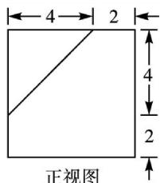
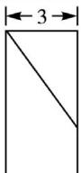
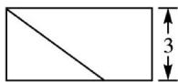

<!-- question-source:start -->
1. (2013 浙江)已知某几何体的三视图(单位: cm)如图所示, 则该几何体的体积是().

  
正视图

  
侧视图  
俯视图

A. $108\mathrm{cm}^3$ B. $100\mathrm{cm}^3$ C. $92\mathrm{cm}^3$ D. $84\mathrm{cm}^3$
<!-- question-source:end -->

![[高中/总复习/专题/立体几何/专题01 关于3视图还原几何体的深度剖析与秒杀-立体几何（文理通用）/专题01_关于3视图还原几何体的深度剖析与秒杀/对点训练/answers/Q00050968A1.md]]
