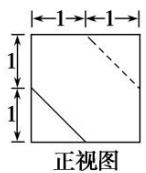
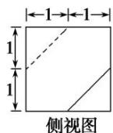
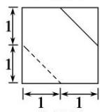

<!-- question-source:start -->
4. (2014 安徽)一个多面体的三视图如图所示，则该多面体的表面积为( )

  
俯视图

A. $21 + \sqrt{3}$ B. $18 + \sqrt{3}$ C. 21 D. 18
<!-- question-source:end -->

![[高中/总复习/专题/立体几何/专题01 关于3视图还原几何体的深度剖析与秒杀-立体几何（文理通用）/专题01_关于3视图还原几何体的深度剖析与秒杀/对点训练/answers/Q00050971A1.md]]
