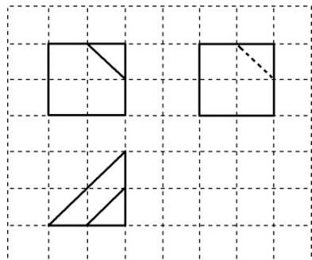

<!-- question-source:start -->
5. 如图, 网格纸上小正方形的边长为 1 , 粗线画出的是某多面体的三视图, 则该多面体的表面积为 ( )

A. 14 B. $10 + 4\sqrt{2}$ C. $\frac{21}{2} + 4\sqrt{2}$ D. $\frac{21 + \sqrt{3}}{2} + 4\sqrt{2}$
<!-- question-source:end -->

![[高中/总复习/专题/立体几何/专题01 关于3视图还原几何体的深度剖析与秒杀-立体几何（文理通用）/专题01_关于3视图还原几何体的深度剖析与秒杀/对点训练/answers/Q00050972A1.md]]
