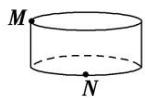
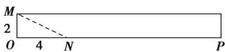

> [!faq]- 《专题01 关于3视图还原几何体的深度剖析与秒杀-立体几何（文理通用）》例题解析
>
> > [!success]- **【答案】** B
>
> > [!note]- **【分析】**
> > 本题未单列分析。
>
> > [!note]- **【解析】**
> > 答案 B 解析 先画出圆柱的直观图，根据题图的三视图可知点 M, N 的位置如图①所示.
> > 
> > - **①**：
> > - **②**：圆柱的侧面展开图及 $M, N$ 的位置 ( $N$ 为 $OP$ 的四等分点) 如图②所示，连接 $MN$ ，则图中 $MN$ 即为 $M$ 到 $N$ 的最短路径。 $ON = \frac{1}{4} \times 16 = 4, OM = 2, \therefore |MN| = \sqrt{OM^2 + ON^2} = \sqrt{2^2 + 4^2} = 2\sqrt{5}$ 。
> >
> > 故选 **B**.
