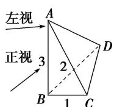
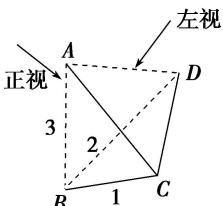
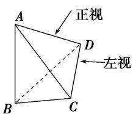

> [!faq]- 《专题01 关于3视图还原几何体的深度剖析与秒杀-立体几何（文理通用）》例题解析
>
> > [!success]- **【答案】** D
>
> > [!note]- **【解析】**
> > 答案 D 解析 四个选项中, 因为观察的位置不同, 得到的三个视图也不同。可从俯视图入手, 以 A 选项中的正方向作为标准。则 A 中的方向, B 中的方向, C 中的方向。依次如图所示
> >
> > 
> >
> > 
> >
> > 
