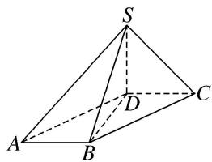

> [!faq]- 《专题01 关于3视图还原几何体的深度剖析与秒杀-立体几何（文理通用）》例题解析
>
> > [!success]- **【答案】** C
>
> > [!note]- **【分析】**
> > 本题未单列分析。
>
> > [!note]- **【解析】**
> > 答案 C 解析 法一：该几何体的直观图为四棱锥 SABCD，如图， $SD \perp$ 平面 ABCD，且 SD = 1，四边形 ABCD 是平行四边形，且 AB = DC = 1，连接 BD，由题意知 $BD \perp DC$ ， $BD \perp AB$ ，且 BD = 1，所以 $S_{四边形ABCD} = 1$ ，所以 $V_{SABCD} = \frac{1}{3} S_{四边形ABCD} \cdot SD = \frac{1}{3}$ ，故选 C.
> >
> > 
> >
> > 法二：由三视图易知该几何体为锥体，所以 $V=\frac{1}{3}Sh$ ，其中 S 指的是锥体的底面积，即俯视图中四边形的面积，易知 S=1，h 指的是锥体的高，从正视图和侧视图易知 h=1，所以 $V=\frac{1}{3}Sh=\frac{1}{3}$ ，
> >
> > 故选 **C**.
