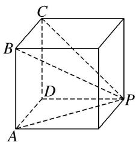

> [!faq]- 《专题01 关于3视图还原几何体的深度剖析与秒杀-立体几何（文理通用）》例题解析
>
> > [!success]- **【答案】** C
>
> > [!note]- **【分析】**
> > 本题未单列分析。
>
> > [!note]- **【解析】**
> > 答案 C 解析 若俯视图为选项 C 中的图形，则该几何体为正方体截去一部分后的四棱锥 P-AB CD，如图所示，该四棱锥的体积 $V=\frac{1}{3}\times(2\times2)\times2=\frac{8}{3}$ ，符合题意。若俯视图为其他选项中的图形，则根据三视图易判断对应的几何体不存在，故选 C.
> > 
