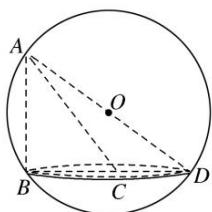

> [!faq]- 《专题01 关于3视图还原几何体的深度剖析与秒杀-立体几何（文理通用）》例题解析
>
> > [!success]- **【答案】** C
>
> > [!note]- **【分析】**
> > 本题未单列分析。
>
> > [!note]- **【解析】**
> > 答案 C 解析 由三视图可知，该几何体是以俯视图的图形为底面，一条侧棱与底面垂直的三棱锥。如图，三棱锥 A-BCD 即为该几何体，且 AB=BD=4, CD=2, BC= $2\sqrt{3}$ ，则 $BD^{2}=BC^{2}+CD^{2}$ ，即 $\angle BCD=90^{\circ}$ 。故底面外接圆的直径 2r=BD=4。
> >
> > 
> >
> > 易知 AD 为三棱锥 A-BCD 的外接球的直径．设球的半径为 R，则由勾股定理得 $4R^{2}=AB^{2}+4r^{2}=32$ ，故该几何体的外接球的表面积为 $4\pi R^{2}=32\pi$ ．
> >
> > 故选 **C**.
