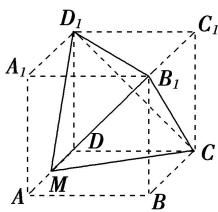

> [!faq]- 《专题01 关于3视图还原几何体的深度剖析与秒杀-立体几何（文理通用）》例题解析
>
> > [!success]- **【答案】** C
>
> > [!note]- **【解析】**
> > 答案 C 解析 在棱长为 2 的正方体 $ABCD - A_{1}B_{1}C_{1}D_{1}$ 中， $M$ 为 $AD$ 的中点，该几何体的直观图如图中三棱锥 $D_{1} - MB_{1}C$ . 故通过计算可得 $D_{1}C = D_{1}B_{1} = B_{1}C = 2\sqrt{2}$ ， $D_{1}M = MC = \sqrt{5}$ ， $MB_{1} = 3$ ，故最长棱的长度为 3，故选 C.
> >
> > 
