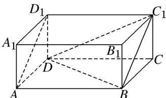

> [!faq]- 《专题01 关于3视图还原几何体的深度剖析与秒杀-立体几何（文理通用）》例题解析
>
> > [!success]- **【答案】** 详见解析
>
> > [!note]- **【解析】**
> > 答案 $\frac{1}{2}$ 解析 由三视图知，该几何体是在长、宽、高分别为 2, 1, 1 的长方体中，截去一个三棱柱 $AA_{1}D_{1}-BB_{1}C_{1}$ 和一个三棱锥 $CBC_{1}D$ 后剩下的几何体，即如图所示的四棱锥 $D-ABC_{1}D_{1}$ ，其中侧面 $ADD_{1}$ 的面积最小，其值为 $\frac{1}{2}$ .
> >
> > 
