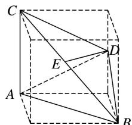

> [!faq]- 《专题01 关于3视图还原几何体的深度剖析与秒杀-立体几何（文理通用）》例题解析
>
> > [!success]- **【答案】** D
>
> > [!note]- **【分析】**
> > 本题未单列分析。
>
> > [!note]- **【解析】**
> > 答案 D 解析 如图所示，该几何体是三棱锥 $D - ABC$ ，其中 $AB = 2\sqrt{2}$ ， $AC = 2$ ， $BC = 2\sqrt{3}$ ，取 $BC$ 的中点 $E$ ，则 $DE = \sqrt{2}$ ，且 $AB \perp AC, DE \perp$ 平面 $ABC$ ，故外接球球心 $O$ 必在直线 $DE$ 上，设三棱锥 $D - ABC$ 外接球的半径为 $R$ ，由 $(OD - DE)^2 + EC^2 = OC^2 = R^2$ ，得 $(R - \sqrt{2})^2 + (\sqrt{3})^2 = R^2$ ，解得 $R^2 = \frac{25}{8}$ ，故三棱锥 $D - ABC$ 的外接球的表面积 $S = 4\pi R^2 = \frac{25\pi}{2}$ ，故选 D.
> >
> > 
