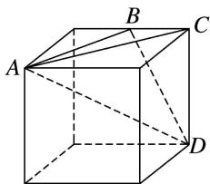

> [!faq]- 《专题01 关于3视图还原几何体的深度剖析与秒杀-立体几何（文理通用）》例题解析
>
> > [!success]- **【答案】** C
>
> > [!note]- **【分析】**
> > 本题未单列分析。
>
> > [!note]- **【解析】**
> > 答案 C 解析 根据三视图知几何体是三棱锥 $D - ABC$ ，为棱长为 4 的正方体的一部分，直观图如图所示.
> >
> > 
> >
> > ∵该多面体的所有顶点都在球 O 的表面上，∴由正方体的性质，得球心 O 到平面 ABC 的距离 d=2，由正方体的性质，可得 $AB=BD=\sqrt{4^{2}+2^{2}}=2\sqrt{5}$ ， $AC=4\sqrt{2}$ ，设 $\triangle ABC$ 的外接圆的半径为 r，在 $\triangle ABC$ 中， $\angle ACB=45^{\circ}$ ，则 $\sin\angle ACB=\frac{\sqrt{2}}{2}$ ，由正弦定理可得， $2r=\frac{AB}{\sin\angle ACB}=\frac{2\sqrt{5}}{\frac{\sqrt{2}}{2}}=2\sqrt{10}$ ，则 $r=\sqrt{10}$ ，则球 O 的半径 $R=\sqrt{r^{2}+d^{2}}=\sqrt{14}$ ，∴球 O 的表面积 $S=4\pi R^{2}=56\pi$ .
> >
> > ## 三 秒杀锥体体积与面积典例
> >
> > 【例题选讲】
