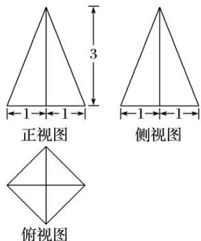
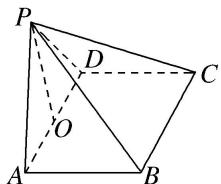

> [!faq]- 《专题01 关于3视图还原几何体的深度剖析与秒杀-立体几何（文理通用）》例题解析
>
> > [!success]- **【答案】** D
>
> > [!note]- **【分析】**
> > 本题未单列分析。
>
> > [!note]- **【解析】**
> > 答案 D 解析 由三视图可知该几何体是一个以俯视图为底面的四棱锥，其直观图如图所示．底面 ABCD 的面积为 $2 \times 2 = 4$ ，高 $PO = \sqrt{3}$ ，故该几何体的体积 $V = \frac{1}{3} \times 4 \times \sqrt{3} = \frac{4\sqrt{3}}{3}$ .
> > 
> > 
