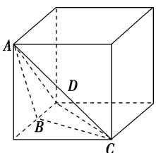

> [!faq]- 《专题01 关于3视图还原几何体的深度剖析与秒杀-立体几何（文理通用）》例题解析
>
> > [!success]- **【答案】** C
>
> > [!note]- **【分析】**
> > 本题未单列分析。
>
> > [!note]- **【解析】**
> > 答案 A 解析 由三视图可知，该几何体为三棱锥，将其放在棱长为 2 的正方体中，如图中三棱锥 A - BCD 所示，故该几何体的体积 $V=\frac{1}{3}\times\frac{1}{2}\times1\times2\times2=\frac{2}{3}$ .
> >
> > 
