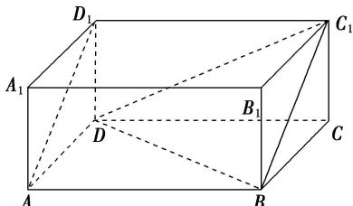

> [!faq]- 《专题01 关于3视图还原几何体的深度剖析与秒杀-立体几何（文理通用）》例题解析
>
> > [!success]- **【答案】** D
>
> > [!note]- **【分析】**
> > 本题未单列分析。
>
> > [!note]- **【解析】**
> > 答案 D 解析 由三视图知，该几何体是在长、宽、高分别为 2, 1, 1 的长方体中，截去一个三棱柱 $AA_{1}D_{1} - BB_{1}C_{1}$ 和一个三棱锥 $C - BC_{1}D$ 后剩下的几何体，即如图所示的四棱锥 $D - ABC_{1}D_{1}$ ，四棱锥 $D - ABC_{1}D_{1}$ 的底面积为 $S_{\text{四边形 }ABC_{1}D_{1}} = 2 \times \sqrt{2} = 2\sqrt{2}$ ，高 $h = \frac{\sqrt{2}}{2}$ ，其体积 $V = \frac{1}{3} S_{\text{四边形 }ABC_{1}D_{1}} h = \frac{1}{3} \times 2\sqrt{2} \times \frac{\sqrt{2}}{2} = \frac{2}{3}$ . 故选 D.
> > 
