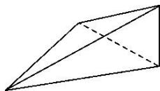

> [!faq]- 《专题01 关于3视图还原几何体的深度剖析与秒杀-立体几何（文理通用）》例题解析
>
> > [!success]- **【答案】** B
>
> > [!note]- **【分析】**
> > 本题未单列分析。
>
> > [!note]- **【解析】**
> > 答案 B 解析 三棱锥的高为 1，底面为等腰三角形，如图，因此表面积是 $\frac{1}{2} \times 2 \times 2 + 2 \times \frac{1}{2} \times \sqrt{5} \times 1$
> >
> > $+\frac{1}{2}\times\sqrt{5}\times2=2+2\sqrt{5}$ . 故选 B.
> >
> > 
