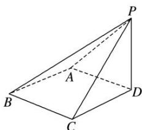

> [!faq]- 《专题01 关于3视图还原几何体的深度剖析与秒杀-立体几何（文理通用）》例题解析
>
> > [!success]- **【答案】** B
>
> > [!note]- **【分析】**
> > 本题未单列分析。
>
> > [!note]- **【解析】**
> > 答案 D 解析 由三视图知，该几何体是底面边长为 $\sqrt{2^2 + 2^2} = 2\sqrt{2}$ 的正方形，高 $PD = 2$ 的四棱锥 $P - ABCD$ ，因为 $PD \perp$ 平面 $ABCD$ ，且四边形 $ABCD$ 是正方形，
> >
> > 
> >
> > 易得 $BC \perp PC, BA \perp PA$ ，又 $PC = \sqrt{PD^{2} + CD^{2}} = \sqrt{2^{2} + (2\sqrt{2})^{2}} = 2\sqrt{3}$ ，所以 $S_{\triangle PCD} = S_{\triangle PAD} = \frac{1}{2} \times 2 \times 2\sqrt{2} = 2\sqrt{2}$ ， $S_{\triangle PAB}=S_{\triangle PBC}=\frac{1}{2}\times2\sqrt{2}\times2\sqrt{3}=2\sqrt{6}$ ，所以几何体的表面积为 $4\sqrt{6}+4\sqrt{2}+8$ .
