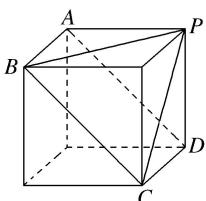

> [!faq]- 《专题01 关于3视图还原几何体的深度剖析与秒杀-立体几何（文理通用）》例题解析
>
> > [!success]- **【答案】** A
>
> > [!note]- **【解析】**
> > 答案 A 解析 由三视图可知该棱锥为如图所示的四棱锥 $P - ABCD$ ， $S_{\triangle PAB} = S_{\triangle PAD} = S_{\triangle PDC} = \frac{1}{2} \times 2 \times 2 = 2$ ， $S_{\triangle PBC} = \frac{1}{2} \times 2\sqrt{2} \times 2\sqrt{2} \times \sin 60^{\circ} = 2\sqrt{3}$ ， $S_{\text{四边形 }ABCD} = 2\sqrt{2} \times 2 = 4\sqrt{2}$ ，故该棱锥的表面积为 $6 + 4\sqrt{2} + 2\sqrt{3}$ .
> >
> > 
