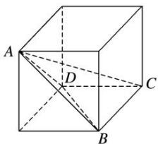

> [!faq]- 《专题01 关于3视图还原几何体的深度剖析与秒杀-立体几何（文理通用）》例题解析
>
> > [!success]- **【答案】** C
>
> > [!note]- **【分析】**
> > 本题未单列分析。
>
> > [!note]- **【解析】**
> > 答案 C 解析 由三视图得该几何体如图中的三棱锥 A-BCD 所示，则 $S_{\triangle ABD}=\frac{1}{2}\times(2\sqrt{2})^{2}\times\frac{\sqrt{3}}{2}=2\sqrt{3}$ ， $S_{\triangle BCD}=\frac{1}{2}\times2\times2=2$ ， $S_{\triangle ABC}=S_{\triangle ADC}=\frac{1}{2}\times2\sqrt{2}\times2=2\sqrt{2}$ ，所以最大面的面积为 $2\sqrt{3}$ ，故选 C.
> >
> > 
