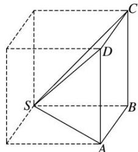
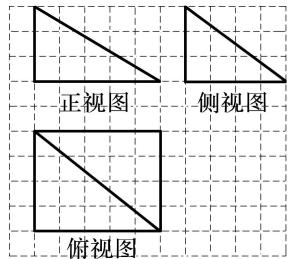
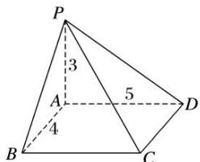

> [!faq]- 《专题01 关于3视图还原几何体的深度剖析与秒杀-立体几何（文理通用）》例题解析
>
> > [!success]- **【答案】** B
>
> > [!note]- **【分析】**
> > 本题未单列分析。
>
> > [!note]- **【解析】**
> > 答案 B 解析 在正方体中还原该四棱锥，如图所示，
> >
> > 
> >
> > 可知 $SD$ 为该四棱锥的最长棱，由三视图可知正方体的棱长为2，故 $SD = \sqrt{2^2 + 2^2 + 2^2} = 2\sqrt{3}$ 。故选B.
> >
> > 15.《九章算术》是我国古代内容极为丰富的数学名著, 系统地总结了战国、秦、汉时期的数学成就。书中将底面为长方形且有一条侧棱与底面垂直的四棱锥称之为 “阳马”, 若某 “阳马” 的三视图如图所示(网格纸上小正方形的边长为 1), 则该 “阳马” 最长的棱长为 \_\_\_\_.
> >
> > 
> >
> > 15. 答案 $5 \sqrt{2}$ 解析 由三视图知，几何体是四棱锥，且四棱锥的一条侧棱与底面垂直，如图所示.
> >
> > 
> >
> > 其中 $PA \perp$ 平面 $ABCD, \therefore PA = 3, AB = CD = 4, AD = BC = 5, \therefore PB = \sqrt{9 + 16} = 5, PC = \sqrt{9 + 16 + 25} = 5\sqrt{2}, PD = \sqrt{9 + 25} = \sqrt{34}$ . $\therefore$ 该几何体最长的棱长为 $5\sqrt{2}$ .
> >
> > ## 四 秒杀组合体三视图典例
> >
> > 秒杀组合体三视图的思维逻辑：
