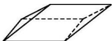

> [!faq]- 《专题01 关于3视图还原几何体的深度剖析与秒杀-立体几何（文理通用）》例题解析
>
> > [!success]- **【答案】** A
>
> > [!note]- **【分析】**
> > 本题未单列分析。
>
> > [!note]- **【解析】**
> > 答案 A 解析 由三视图可知，该几何体的下底面是长为 4，宽为 2 的矩形，左右两个侧面是底边为 2，高为 $2\sqrt{2}$ 的三角形，前后两个侧面是底边为 4，高为 $\sqrt{5}$ 的平行四边形，所以该几何体的表面积为 $S = 4 \times 2 + 2 \times \frac{1}{2} \times 2 \times 2\sqrt{2} + 2 \times 4 \times \sqrt{5} = 8 + 4\sqrt{2} + 8\sqrt{5}$ .
> >
> > 
