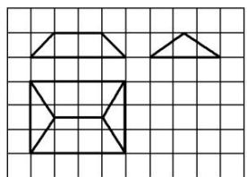
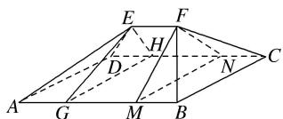

> [!faq]- 《专题01 关于3视图还原几何体的深度剖析与秒杀-立体几何（文理通用）》例题解析
>
> > [!success]- **【答案】** B
>
> > [!note]- **【分析】**
> > 本题未单列分析。
>
> > [!note]- **【解析】**
> > 答案 $\frac{14}{3}\pi 6 + (6 + \sqrt{13})\pi$ 解析 由三视图知，该几何体是由四分之一球与半个圆锥组合而成，则该组合体的体积为 $V = \frac{1}{4} \times \frac{4}{3}\pi \times 2^3 + \frac{1}{2} \times \frac{1}{3}\pi \times 2^2 \times 3 = \frac{14}{3}\pi$ ，表面积为 $S = \frac{1}{4} \times 4\pi \times 2^2 + \frac{1}{2} \times \pi \times 2^2 + \frac{1}{2} \times 4 \times 3 + \frac{1}{2} \times \frac{1}{2} \times 2\pi \times 2 \times \sqrt{3^2 + 2^2} = 6 + (6 + \sqrt{13})\pi$ .
> > 8.《九章算术》卷五商功中有如下问题：今有刍甍，下广三丈，袤四丈，上袤二丈，无广，高一丈，问积几何？刍甍：底面为矩形的屋脊状的几何体(网格纸中粗线部分为其三视图，设网格纸上每个小正方形的边长为1)，那么该刍甍的体积为()
> > 
> > A. 4 B. 5 C. 6 D. 12
> > 8. 答案 B 解析
> > 
> > 如图，由三视图可还原得几何体 $ABCDEF$ ，过 $E,F$ 分别作垂直于底面的截面 $EGH$ 和 $FMN$ ，将原几何体拆分成两个底面积为3，高为1的四棱锥和一个底面积为 $\frac{3}{2}$ ，高为2的三棱柱，所以 $V_{ABCDEF} = 2V_{\text{四棱锥}}$ $E - ADHG + V_{\text{三棱柱}EHG - FNM} = 2\times \frac{1}{3}\times 3\times 1 + \frac{3}{2}\times 2 = 5$ ，
> >
> > 故选 **B**.
