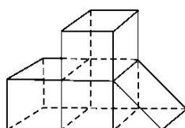

> [!faq]- 《专题01 关于3视图还原几何体的深度剖析与秒杀-立体几何（文理通用）》例题解析
>
> > [!success]- **【答案】** A
>
> > [!note]- **【解析】**
> > 答案 A 解析 由三视图可知，该几何体为如图所示的几何体，其体积为 3 个正方体的体积加三棱柱的体积，所以 $V = 3 + \frac{1}{2} = \frac{7}{2}$ . 故选 A.
> >
> > 
> >
> > ## 五 秒杀切割体三视图典例
> >
> > 秒杀切割体三视图的思维逻辑：
