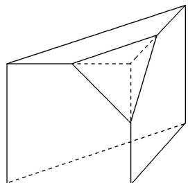

> [!faq]- 《专题01 关于3视图还原几何体的深度剖析与秒杀-立体几何（文理通用）》例题解析
>
> > [!success]- **【答案】** D
>
> > [!note]- **【分析】**
> > 本题未单列分析。
>
> > [!note]- **【解析】**
> > 答案 D 解析 由三视图可知，该几何体为一个直三棱柱切去一个小三棱锥后剩余的几何体，如图所示．所以该多面体的表面积 $S = 2 \times \left(2^2 - \frac{1}{2} \times 1 \times 1\right) + \frac{1}{2} \times (2^2 - 1^2) + \frac{1}{2} \times 2^2 + 2 \times 2\sqrt{2} + \frac{1}{2} \times \frac{\sqrt{3}}{2} \times (\sqrt{2})^2 = \frac{21 + \sqrt{3}}{2} + 4\sqrt{2}$ ，故选 D.
> > 
