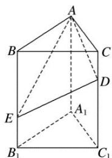

> [!faq]- 《专题01 关于3视图还原几何体的深度剖析与秒杀-立体几何（文理通用）》例题解析
>
> > [!success]- **【答案】** 详见解析
>
> > [!note]- **【解析】**
> > 答案 $2 \sqrt{3}$ 解析 依题意得，该几何体是由如图所示的三棱柱 $ABC - A_{1}B_{1}C_{1}$ 截去四棱锥 $A - BEDC$ 得到的，故其体积 $V = \frac{1}{2} \times 2^{2} \times \frac{\sqrt{3}}{2} \times 3 - \frac{1}{3} \times \frac{1 + 2}{2} \times 2 \times \sqrt{3} = 2\sqrt{3}$ .
> >
> > 
