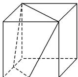
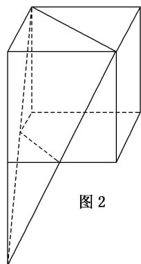

> [!faq]- 《专题01 关于3视图还原几何体的深度剖析与秒杀-立体几何（文理通用）》例题解析
>
> > [!success]- **【答案】** 详见解析
>
> > [!note]- **【分析】**
> > 本题未单列分析。
>
> > [!note]- **【解析】**
> > 答案 $\frac{17}{3}$ 解析 根据三视图, 我们先画出其几何直观图, 几何体由正方体切割而成, 即正方体截去一个棱台. 如图 1 所示, 把棱台补成锥体如图 2, $V_{\text {棱台}} = 2 \times 2 \times \frac{1}{2} \times 4 \times \frac{1}{3} - 1 \times 1 \times \frac{1}{2} \times 2 \times \frac{1}{3} = \frac{7}{3}$ , 故所求几何体的体积 $V = 2^{3} - \frac{7}{3} = \frac{17}{3}$ .
> >
> >   
> > 图1
> >
> > 
