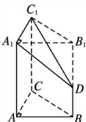

> [!faq]- 《专题01 关于3视图还原几何体的深度剖析与秒杀-立体几何（文理通用）》例题解析
>
> > [!success]- **【答案】** C
>
> > [!note]- **【分析】**
> > 本题未单列分析。
>
> > [!note]- **【解析】**
> > 答案 C 解析 由三视图可知，该几何体的直观图如图所示，为直三棱柱 $ABC-A_{1}B_{1}C_{1}$ 截掉了三棱锥 $D-A_{1}B_{1}C_{1}$ ，所以其体积 $V=VABC-A_{1}B_{1}C_{1}-VD-A_{1}B_{1}C_{1}=\frac{1}{2}\times3\times4\times5-\frac{1}{3}\times\frac{1}{2}\times3\times4\times3=24.$
> > 
