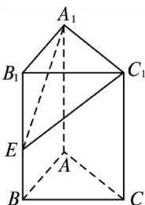

> [!faq]- 《专题01 关于3视图还原几何体的深度剖析与秒杀-立体几何（文理通用）》例题解析
>
> > [!success]- **【答案】** 详见解析
>
> > [!note]- **【分析】**
> > 本题未单列分析。
>
> > [!note]- **【解析】**
> > ．答案 24 解析 由三视图可知该几何体为如图所示的三棱柱割掉了一个三棱锥. $V_{A_1EC_1 - ABC} = V_{A_1B_1C_1 - ABC} - V_{E - A_1B_1C_1} = \frac{1}{2}\times 3\times 4\times 5 - \frac{1}{3}\times \frac{1}{2}\times 3\times 4\times 3 = 30 - 6 = 24.$
> >
> > 
