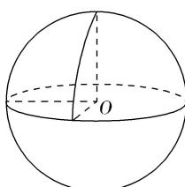

> [!faq]- 《专题01 关于3视图还原几何体的深度剖析与秒杀-立体几何（文理通用）》例题解析
>
> > [!success]- **【答案】** A
>
> > [!note]- **【解析】**
> > 答案 A 解析 由题知，该几何体的直观图如图所示，它是一个球(被过球心 O 且互相垂直的三个平面)切掉左上角的 $\frac{1}{8}$ 后得到的组合体，其表面积是球面面积的 $\frac{7}{8}$ 和三个 $\frac{1}{4}$ 圆面积之和，易得球的半径为 2，则得 $S=\frac{7}{8}\times4\pi\times2^{2}+3\times\frac{1}{4}\pi\times2^{2}=17\pi$ 。故选 A.
> >
> > 
