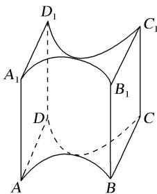

> [!faq]- 《专题01 关于3视图还原几何体的深度剖析与秒杀-立体几何（文理通用）》例题解析
>
> > [!success]- **【答案】** B
>
> > [!note]- **【分析】**
> > 本题未单列分析。
>
> > [!note]- **【解析】**
> > 答案 B 解析 由三视图还原原几何体如右图：该几何体为两个空心半圆柱相切，半圆柱的半径为2，母线长为4，左右为边长是4的正方形.∴该几何体的表面积为 $2\times4\times4+2\pi\times2\times4+2(4\times4-\pi\times2^{2})=64+8\pi=8(\pi+8)$ .
> > 
