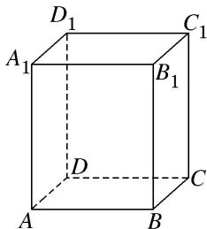

> [!faq]- 《专题01 关于3视图还原几何体的深度剖析与秒杀-立体几何（文理通用）》例题解析
>
> > [!success]- **【答案】** 详见解析
>
> > [!note]- **【分析】**
> > 本题未单列分析。
>
> > [!note]- **【解析】**
> > 答案 ①② 解析 由三视图可知，该几何体是正四棱柱，作出其直观图为如图所示的四棱柱 ABCD - $A_{1}B_{1}C_{1}D_{1}$ ，当选择的 4 个点是 $B_{1}, B, C, C_{1}$ 时，可知①正确；当选择的 4 个点是 $B, A, B_{1}, C$ 时，可知②正确；易知③不正确。
> >
> > 
