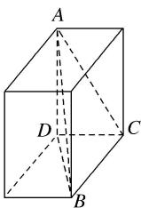

> [!faq]- 《专题01 关于3视图还原几何体的深度剖析与秒杀-立体几何（文理通用）》例题解析
>
> > [!success]- **【答案】** B
>
> > [!note]- **【解析】**
> > 答案 B 解析 由三视图可知，棱锥为三棱锥，放在长方体中，为如图所示的三棱锥 A-BCD。该三棱锥的外接球就是长方体的外接球，外接球的直径等于长方体的体对角线的长，所以球的半径 $R = \frac{1}{2} \times \sqrt{2^2 + 2^2 + 1^2} = \frac{3}{2}$ ，则外接球的体积 $V = \frac{4}{3}\pi \times \left(\frac{3}{2}\right)^3 = \frac{9\pi}{2}$ . 故选 B.
> >
> > 正视图  
> > 
