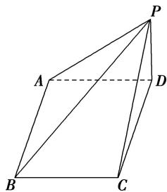

> [!faq]- 《专题01 关于3视图还原几何体的深度剖析与秒杀-立体几何（文理通用）》例题解析
>
> > [!success]- **【答案】** 详见解析
>
> > [!note]- **【分析】**
> > 本题未单列分析。
>
> > [!note]- **【解析】**
> > 答案 $\frac{2}{3}$ 解析 由题图可知该几何体是一个四棱锥，如图所示，其中 $PD \perp$ 平面 $ABCD$ ，底面 $ABCD$ 是一个对角线长为 2 的正方形，底面积 $S = \frac{1}{2} \times 2 \times 2 = 2$ ，高 $h = 1$ ，则该几何体的体积 $V = \frac{1}{3} Sh = \frac{2}{3}$ .
> >
> > 
