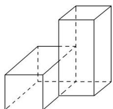

> [!faq]- 《专题01 关于3视图还原几何体的深度剖析与秒杀-立体几何（文理通用）》例题解析
>
> > [!success]- **【答案】** 详见解析
>
> > [!note]- **【解析】**
> > 答案 72 32 解析 由三视图可知，该几何体为两个相同长方体组合，长方体的长、宽、高分别为 $4 \mathrm{~cm}$ 、 $2 \mathrm{~cm}$ 、 $2 \mathrm{~cm}$ ，其直观图如下：
> >
> > 
> >
> > 其体积 $V=2\times2\times2\times4=32(\mathrm{cm}^{3})$ ，由于两个长方体重叠部分为一个边长为 2 的正方形，所以表面积为 $S=2(2\times2\times2+2\times4\times4)-2\times2\times2=2\times(8+32)-8=72(\mathrm{cm}^{2})$ .
