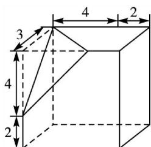

> [!faq]- 《专题01 关于3视图还原几何体的深度剖析与秒杀-立体几何（文理通用）》例题解析
>
> > [!success]- **【答案】** B
>
> > [!note]- **【解析】**
> > 答案：B 解析 由三视图可知，该几何体是如图所示长方体去掉一个三棱锥，故几何体的体积是 $6 \times 3$
> >
> > $\times6-\frac{1}{3}\times\frac{1}{2}\times3\times4^{2}=100(cm^{3})$ . 故选 B.
> >
> > 
