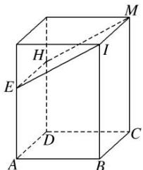

> [!faq]- 《专题01 关于3视图还原几何体的深度剖析与秒杀-立体几何（文理通用）》例题解析
>
> > [!success]- **【答案】** B
>
> > [!note]- **【分析】**
> > 本题未单列分析。
>
> > [!note]- **【解析】**
> > 答案 B 解析 如图，三视图所对应的几何体是长、宽、高分别为 2,2,3 的长方体去掉一个三棱柱后的棱柱 ABIE-DCMH，则该几何体的表面积 $S=(2\times2)\times5+\left(\frac{1}{2}\times1\times2\right)\times2+2\times1+2\times\sqrt{5}=24+2\sqrt{5}$ . 故选 B.
> >
> > 
