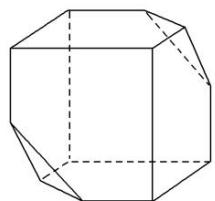

> [!faq]- 《专题01 关于3视图还原几何体的深度剖析与秒杀-立体几何（文理通用）》例题解析
>
> > [!success]- **【答案】** A
>
> > [!note]- **【分析】**
> > 本题未单列分析。
>
> > [!note]- **【解析】**
> > 答案 A 解析 由几何体的三视图可知，该几何体的直观图如图所示，因此该几何体的表面积为 $6 \times \left(4 - \frac{1}{2}\right) + 2 \times \frac{\sqrt{3}}{4} \times (\sqrt{2})^2 = 21 + \sqrt{3}$ . 故选 A.
> >
> > 
