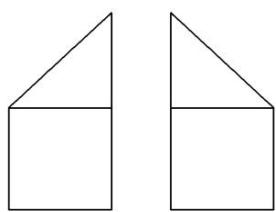
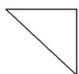

<!-- question-source:start -->
[例 4] (1)(2017·全国 I) 某多面体的三视图如图所示，其中正视图和左视图都由正方形和等腰直角三角形组成，正方形的边长为 2，俯视图为等腰直角三角形．该多面体的各个面中有若干个是梯形，这些梯形的面积之和为( )

A. 10 B. 12 C. 14 D. 16
<!-- question-source:end -->

![[高中/总复习/专题/立体几何/专题01 关于3视图还原几何体的深度剖析与秒杀-立体几何（文理通用）/专题01_关于3视图还原几何体的深度剖析与秒杀_立体几何_文理通用_/例题/answers/Q00039474A1.md]]
