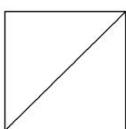
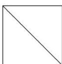
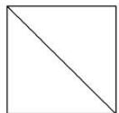

<!-- question-source:start -->
[例 5] (1)(2015·全国Ⅱ)一个正方体被一个平面截去一部分后，剩余部分的三视图如下图，则截去部分体积与剩余部分体积的比值为()

  
正(主)视图

  
侧(左)视图

  
俯视图

A. $\frac{1}{8}$ B. $\frac{1}{7}$ C. $\frac{1}{6}$ D. $\frac{1}{5}$
<!-- question-source:end -->

![[高中/总复习/专题/立体几何/专题01 关于3视图还原几何体的深度剖析与秒杀-立体几何（文理通用）/专题01_关于3视图还原几何体的深度剖析与秒杀_立体几何_文理通用_/例题/answers/Q00039486A1.md]]
