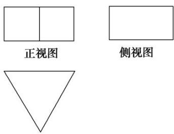

<!-- question-source:start -->
2. 如图是一个几何体的三视图，若其正视图的面积等于 $8 \mathrm{~cm}^{2}$ ，俯视图是一个面积为 $4 \sqrt{3} \mathrm{~cm}^{2}$ 的正三角形，则其侧视图的面积等于 \_\_\_\_.

  
俯视图
<!-- question-source:end -->

![[高中/总复习/专题/立体几何/专题01 关于3视图还原几何体的深度剖析与秒杀-立体几何（文理通用）/专题01_关于3视图还原几何体的深度剖析与秒杀_立体几何_文理通用_/对点训练/answers/Q00039439A1.md]]
