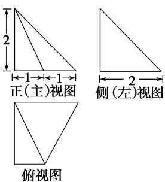

<!-- question-source:start -->
8. (2018·北京)某四棱锥的三视图如图所示, 在此四棱锥的侧面中, 直角三角形的个数为( )

正视图

侧(左)视图

  
俯视图

A. 1 B. 2 C. 3 D. 4
<!-- question-source:end -->

![[高中/总复习/专题/立体几何/专题01 关于3视图还原几何体的深度剖析与秒杀-立体几何（文理通用）/专题01_关于3视图还原几何体的深度剖析与秒杀_立体几何_文理通用_/对点训练/answers/Q00039445A1.md]]
