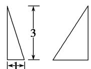
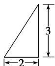
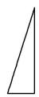
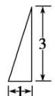
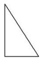
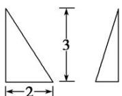
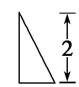
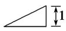
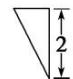
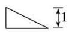

<!-- question-source:start -->
9. 已知以下三视图中有三个同时表示某一个棱锥，则下列不是该三棱锥的三视图的是( )

  
正视图  
侧视图

  
正视图

  
侧视图

  
正视图  
侧视图

  
正视图  
侧视图

  
俯视图

  
俯视图

  
俯视图

俯视图 C
<!-- question-source:end -->

![[高中/总复习/专题/立体几何/专题01 关于3视图还原几何体的深度剖析与秒杀-立体几何（文理通用）/专题01_关于3视图还原几何体的深度剖析与秒杀_立体几何_文理通用_/对点训练/answers/Q00039446A1.md]]
