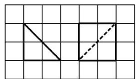
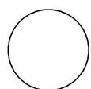
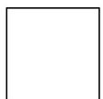
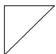
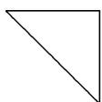

<!-- question-source:start -->
12. 如图, 网格纸上小正方形的边长为 1 , 粗线画出的是某几何体的正视图和侧视图, 且该几何体的体积为 $\frac{8}{3}$ , 则该几何体的俯视图可以是( )

A

B

C

D
<!-- question-source:end -->

![[高中/总复习/专题/立体几何/专题01 关于3视图还原几何体的深度剖析与秒杀-立体几何（文理通用）/专题01_关于3视图还原几何体的深度剖析与秒杀_立体几何_文理通用_/对点训练/answers/Q00039449A1.md]]
