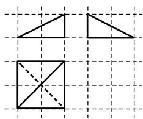

<!-- question-source:start -->
13. 如图, 网格纸上小正方形的边长为 1 , 粗线画出的是某三棱锥的三视图, 则该几何体的体积为( )

A. 4 B. 2 C. $\frac{4}{3}$ D. $\frac{2}{3}$
<!-- question-source:end -->

![[高中/总复习/专题/立体几何/专题01 关于3视图还原几何体的深度剖析与秒杀-立体几何（文理通用）/专题01_关于3视图还原几何体的深度剖析与秒杀_立体几何_文理通用_/对点训练/answers/Q00039450A1.md]]
