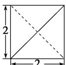
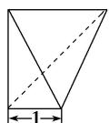
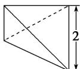

<!-- question-source:start -->
15. (2019·福建漳州调研)某三棱锥的三视图如图所示，则该三棱锥的最长棱的长度为( )

正（主）视图

侧（左）视图

  
俯视图

A. $\sqrt{5}$ B. $2\sqrt{2}$ C. 3 D. $2\sqrt{3}$
<!-- question-source:end -->

![[高中/总复习/专题/立体几何/专题01 关于3视图还原几何体的深度剖析与秒杀-立体几何（文理通用）/专题01_关于3视图还原几何体的深度剖析与秒杀_立体几何_文理通用_/对点训练/answers/Q00039452A1.md]]
