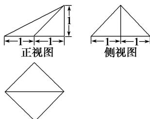

<!-- question-source:start -->
3. 一个几何体的三视图如图所示，则该几何体的体积为\_\_\_\_。

  
俯视图
<!-- question-source:end -->

![[高中/总复习/专题/立体几何/专题01 关于3视图还原几何体的深度剖析与秒杀-立体几何（文理通用）/专题01_关于3视图还原几何体的深度剖析与秒杀_立体几何_文理通用_/对点训练/answers/Q00039459A1.md]]
