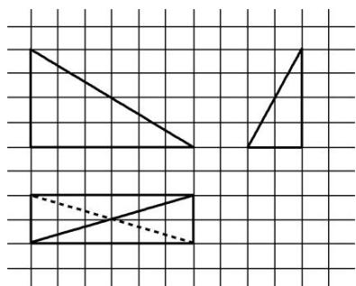

<!-- question-source:start -->
7. 如图所示, 网格纸上小正方形的边长为 1 , 粗实线及粗虚线画出的是三棱锥的三视图, 则此三棱锥的体积是( )

A. 8 B. 16 C. 24 D. 48
<!-- question-source:end -->

![[高中/总复习/专题/立体几何/专题01 关于3视图还原几何体的深度剖析与秒杀-立体几何（文理通用）/专题01_关于3视图还原几何体的深度剖析与秒杀_立体几何_文理通用_/对点训练/answers/Q00039463A1.md]]
