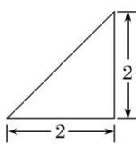
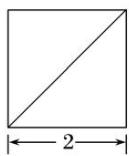
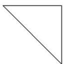

<!-- question-source:start -->
14. 某四棱锥的三视图如图所示，则该四棱锥的最长棱的长度为( )

  
正(主)视图

  
侧(左)视图

  
俯视图

A. $3\sqrt{2}$ B. $2\sqrt{3}$ C. $2\sqrt{2}$ D. 2
<!-- question-source:end -->

![[高中/总复习/专题/立体几何/专题01 关于3视图还原几何体的深度剖析与秒杀-立体几何（文理通用）/专题01_关于3视图还原几何体的深度剖析与秒杀_立体几何_文理通用_/对点训练/answers/Q00039470A1.md]]
