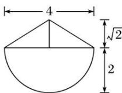
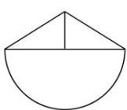
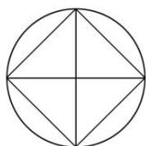

<!-- question-source:start -->
2. 已知一几何体的三视图如图所示, 它的侧(左)视图与正(主)视图相同, 则该几何体的体积为( )

  
正(主)视图

  
侧(左)视图

  
俯视图

A. $\frac{16}{3}\pi +\frac{8\sqrt{2}}{3}$ B. $\frac{8}{3}\pi +\frac{8\sqrt{2}}{3}$ C. $\frac{16}{3}\pi +8\sqrt{2}$ D. $\frac{8}{3}\pi +8\sqrt{2}$
<!-- question-source:end -->

![[高中/总复习/专题/立体几何/专题01 关于3视图还原几何体的深度剖析与秒杀-立体几何（文理通用）/专题01_关于3视图还原几何体的深度剖析与秒杀_立体几何_文理通用_/对点训练/answers/Q00039476A1.md]]
