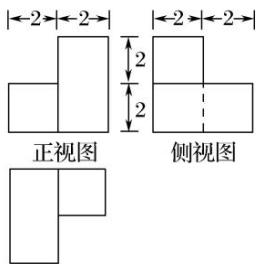

<!-- question-source:start -->
4. (2016·浙江)某几何体的三视图如图所示(单位: cm), 则该几何体的表面积是 $\mathrm{cm}^{2}$ , 体积是 $\mathrm{cm}^{3}$ .

  
俯视图
<!-- question-source:end -->

![[高中/总复习/专题/立体几何/专题01 关于3视图还原几何体的深度剖析与秒杀-立体几何（文理通用）/专题01_关于3视图还原几何体的深度剖析与秒杀_立体几何_文理通用_/对点训练/answers/Q00039478A1.md]]
